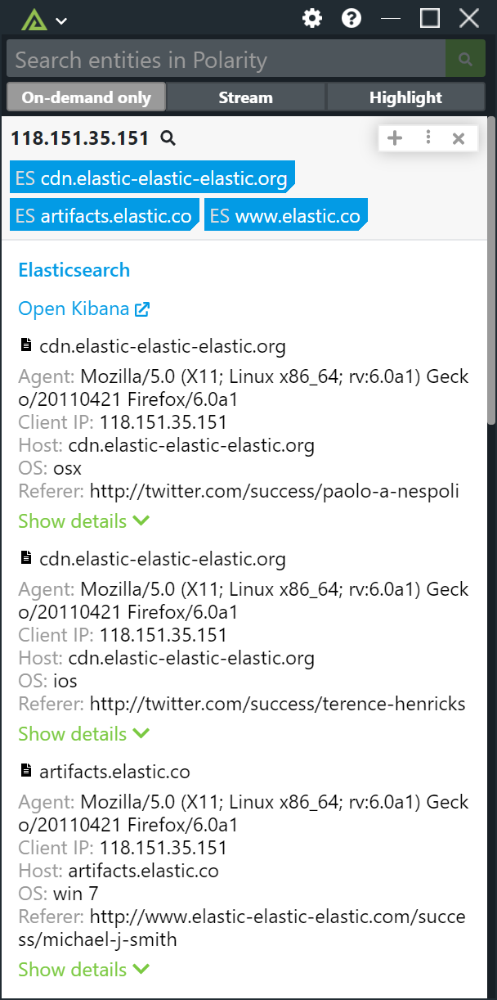
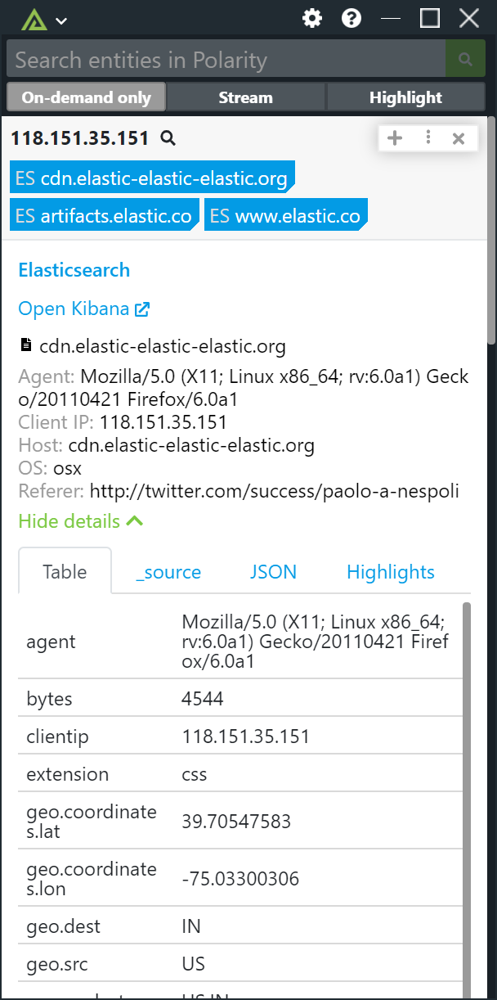
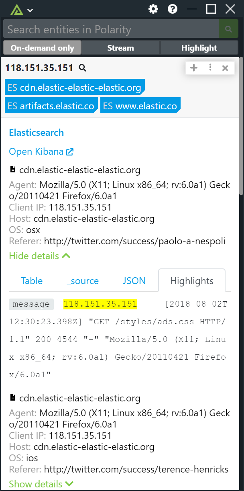

# Polarity Elasticsearch Integration

Polarity's Elasticsearch integration can search your ES instance using a user provided search and return results via the Polarity Overlay Window or HUD.  Similar to Kibana, the integration will return highlighted document fields as well as the full `_source` field.  In addition, a table and JSON view are also provided. .

|  |||
|---|---|---|
|*Customized Details View* |*Table view of data*| *Optional Highlights Enabled*|

> Note that by default the ES integration will receive ALL entity types.  It is important that you select the "Manage Integration Data" option and turn off entity types you do not want sent to your ES integration.

## Elasticsearch Integration Options

### Elasticsearch URL


URL for your Elasticsearch REST API including the schema and port if applicable (e.g., https://elastic.prod:9200)

```
https://elastic.prod:9200
```

### Kibana URL

URL for your Elasticsearch Kibana interface including the schema and port if applicable (e.g., https://elastic.prod:9243/app/kibana).  If left blank no link to Kibana will be provided.

> Note that this link is not yet able to link directly to a returned document id but only takes you to the Kibana web interface.

```
https://elastic.prod:9243/app/kibana
```

### Username

Elasticsearch account username (Leave this blank if you are not using Basic Auth via Shield)

### Password

Elasticsearch account password (Leave this blank if you are not using Basic Auth via Shield)

### API Key

Elasticsearch API Key in Base64 format. Leave this blank if you are not using authentication or you are using Basic Auth via X-Pack (i.e., if you have a username and password).

### Index for Elasticsearch

Comma delimited list of Elasticsearch indexes you want searched for results (no spaces between commas)

```
kibana_sample_data_logs,kibana_sample_data_flights
```

### Search Query

The search query to execute as JSON. The top level property should be a `query` object and must be a valid JSON search request when sent to the ES `_search` REST endpoint.  The search query can make use of the templated variable `{{entity}}` which will be replaced by the entity recognized on the user's screen.

As an example, with the search query defined as:

```
{"query": { "simple_query_string": { "query": "\"{{entity}}\"" } }, "from": 0, "size": 10, "sort": [ {"timestamp": "desc" } ] } }
```

If the user has the IP 8.8.8.8 on their screen the integration will execute the following query:

```
{"query": { "simple_query_string": { "query": "\"8.8.8.8\"" } }, "from": 0, "size": 10, "sort": [ {"timestamp": "desc" } ] } }
```

If you'd like to search certain fields you can use the `fields` property along with the `simple_query_string`.  For example, to only search the `ip` field you could use the following search:

```
{"query": { "simple_query_string": { "query": "\"{{entity}}\"", "fields": ["ip"]}}, "from": 0, "size": 10, "sort": [ {"timestamp": "desc" } ] } }
```

If you'd like to search a specific time range you can do that using normal Elasticsearch JSON search syntax.  For example, do search data from the last 365 days you can use the following query assuming your timestamp field is called `timestamp`.  

```
{"query": { "bool": { "must": [ { "range": {"timestamp": {"gte": "now-365d/d","lt": "now/d"}}},{"query_string": {"query":"\"{{entity}}\""}}]}},"from": 0,"size": 10}
```

### Enable Highlighting

If checked, the integration will display highlighted search terms via the Elasticsearch Highlighter.  For more information on the Elasticsearch Highlighter please see the following documentation: https://www.elastic.co/guide/en/elasticsearch/reference/current/search-request-highlighting.html

### Highlight Query

The highlighter query to execute when a user clicks to view additional details. The top level property should be a `query` object. This query should typically match the query portion of your `Search Query`. Highlighting will attempt to highlight against all fields and will return the first 10 results. Only runs if the `Enable Highlighting` option is checked

```
{"query": { "simple_query_string": { "query": "\"{{entity}}\"" } } }
```

### Summary Fields

Comma delimited list of field names to include as part of the summary tags. JSON dot notation can be used to target nested attributes including fields inside the `_source` attribute. Fields must be returned by your search query to be displayed. You can change the label for your fields by prepending the label to the field path and separating it with a colon (i.e., "<label>:<json path>"). If left blank, a result count will be shown. This option should be set to "Only Admins can View and Edit".

For example, to display a `severity` summary field where the  `severity` field is on the `_source` attribute you would do:

```
_source.severity 
```

If you wanted to include a label you would do:

```
Severity:_source.severity
```

### Details Fields

Comma delimited list of field names to include as part of the details block. JSON dot notation can be used to target nested attributes including fields inside the `_source` attribute. Fields must be returned by your search query to be displayed. You can change the label for your fields by prepending the label to the field path and separating it with a colon (i.e., "<label>:<json path>"). If left blank, all fields will be shown. This option should be set to "Only Admins can View and Edit".

For example, to display three fields called 'severity', 'falsePositive', and 'confidence' which are on the `_source` object you would do:

```
Severity:_source.severity, False Positive?:_source.falsePositive, Confidence:_source.confidence 
```

### Document Title Field

"_source" field to use as the title for each returned document in the details template. This field must be returned by your search query.  Defaults to `timestamp`.

### Max Concurrent Search Requests

Maximum number of concurrent search requests (defaults to 10). Integration must be restarted after changing this option.

### Minimum Time Between Searches

Minimum amount of time in milliseconds between each entity search (defaults to 50). Integration must be restarted after changing this option.

## Installation Instructions

Installation instructions for integrations are provided on the [PolarityIO GitHub Page](https://polarityio.github.io/).

## Polarity

Polarity is a memory-augmentation platform that improves and accelerates analyst decision making.  For more information about the Polarity platform please see:

https://polarity.io/
